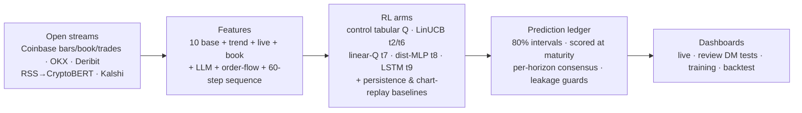

# BTC Short-Horizon Price Prediction — an Online Reinforcement-Learning A/B Experiment

A live, continuously-learning system that predicts Bitcoin's price 5, 15, and
30 minutes ahead, structured as a **controlled experiment**: a frozen control
model and a ladder of treatments, each isolating one capability, all scored
against the same market minutes and against two explicit naive baselines.
Built entirely on open, no-auth data streams.

## The model ladder

| Arm | Model class | Isolates |
|---|---|---|
| — | Persistence (predict no change) | the noise floor |
| rp | Chart replay: past h-min move copied forward | the time-shift illusion |
| control | Tabular Q-learning (81 states × 21 actions) | discretized RL baseline |
| t2 | LinUCB contextual bandit (α=0.3) | continuous features + uncertainty-aware selection |
| t6 | LinUCB + live streams (perp basis, funding, exchange dispersion, order-book imbalance/spread, order-flow imbalance, CryptoBERT news sentiment) | market microstructure + text |
| t7 | Linear function approximation, SGD on Q(s,a) | the L2 rung |
| t8 | Small distributional network: predicts the delta **distribution**, acts on its mode | the L3 rung |
| t9 | LSTM over the raw 60-step 1m return sequence, distributional output | the L4 rung (sequence memory) |
| consensus | Skill-weighted median poll of all +5-min predictors | ensembling |

All learners share one action space (**volatility-scaled**: each action is
k × live σ_h, k ∈ 0…±1.5 — an MAE-scored point forecast is a conditional
median, so tail actions are excluded) and one reward (+1 on exact integer
match, else −|error|/100, plus a small correct-direction credit for the
function-approximation arms).

## Methodology (industry-standard evaluation)

- **Chronological splits only** — train on the past, test on the future;
  no shuffling, no lookahead. Live scoring uses only matured ground truth.
- **Offline gate before online deployment** (`scripts/offline_gate.py`):
  MAE within 2% of persistence AND <95% action-identity with any simpler
  arm. Three treatments (t3/t4/t5) were retired as proven duplicates.
- **Baselines on every chart**: persistence and chart-replay, so "beats
  doing nothing" and "beats copying the chart" are visible per slot.
- **Metrics**: MAE, RMSE, tolerance rates (±$10/±$50), directional accuracy
  with one-sided binomial significance, a **replay index** (how much of a
  prediction is the last price carried forward), and **calibrated 80%
  prediction intervals** (rolling conformal quantiles) scored on coverage
  and width.
- **Two-speed online learning** with safety rails: an immediate update per
  scored prediction, plus hourly experience replay over 24h gated by a 3h
  hold-out — any retrain that worsens hold-out MAE is reverted.
- **Adaptive bias intercept** (trailing median residual, shrunk ×0.5 and
  capped at ±0.5σ) to remove conditional trend bias without trend-chasing.

## The noise floor (why MAE targets must respect physics)

MAE has a hard floor: the average unpredictable move. Measured on 60 days:
**$31 / $50 / $72** at 5/15/30 min. Converged models sit within 1–7% of it
(L2: $32.0/$50.7/$77.3). Errors above these levels on live dashboards track
market volatility — persistence scores the same there — not model failure.

## Live data streams (all open, verified)

Coinbase Exchange (1m bars, L2 book, trades), Kraken, Bitstamp, Gemini,
OKX (funding), Deribit (perp mark), alternative.me (Fear & Greed),
mempool.space, a BRTI-style composite (volume-weighted across the CME CF
BRTI constituent exchanges), CryptoBERT (local, Apple-GPU) over
CoinDesk/Cointelegraph/Decrypt RSS, and the Robinhood/Kalshi BTC-15-min
prediction market (which settles on CF BRTI) — tracked live with our own
model-implied P(up) beside the market's odds.

## Dashboards

| Page | Purpose |
|---|---|
| `site/live_online.html` | Live predictions: per-horizon graphs (zoom/pan/crosshair), prediction bands, ledgers, consensus call, prediction-market tracker |
| `site/experiment_review.html` | The experiment, reviewed: arm cards (architecture/features/reward/sampling), offline + online scoreboards, per-horizon comparisons |
| `site/live_training.html` | Batch training curves, streamed live during training |
| `site/index.html` | 120-day batch backtest report |

## Architecture



## Reproducibility

- Dependencies pinned in `requirements.txt`; unit tests in `tests/`
  (`python3 tests/test_core.py`).
- All learners use fixed seeds (7, or the horizon number for per-horizon
  bandits); batch scripts are deterministic given the cached bar data.
- Tick-level trades are being archived by `python -m btc_rl.ticks`
  (results/ticks.jsonl) as the data foundation for future sub-minute models.

## Run it

```bash
pip install -r requirements.txt
python3 -m http.server 8787 &            # serve dashboards
python3 -m btc_rl.online &               # live predict/learn daemon
python3 -m btc_rl.train --days 120 --live   # batch RL + live curves
python3 scripts/train_l2.py --days 60    # L2 batch training
python3 scripts/train_l3.py --days 60    # L3 batch training
python3 scripts/offline_gate.py          # gate any new treatment
python3 scripts/evaluate.py              # multi-angle evaluation
python3 scripts/debug_arms.py            # era-split per-arm debugging
```
